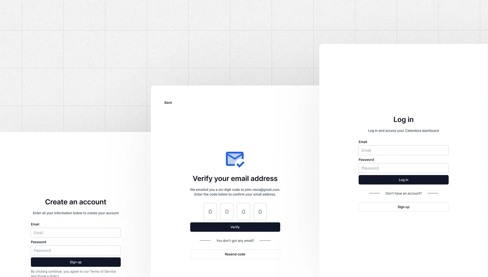

# **🔐 Auth App – Express + JWT + Email OTP**

📌 Description

Design by : https://dribbble.com/altingrc

Ce projet est une API REST d’authentification construite avec :

Express comme framework backend.

JWT (JSON Web Tokens) pour gérer les sessions utilisateurs.

Email OTP (One-Time Password) pour la vérification d’email.

⚡ Objectif : Fournir un système d’inscription, vérification d’email et connexion sécurisé.